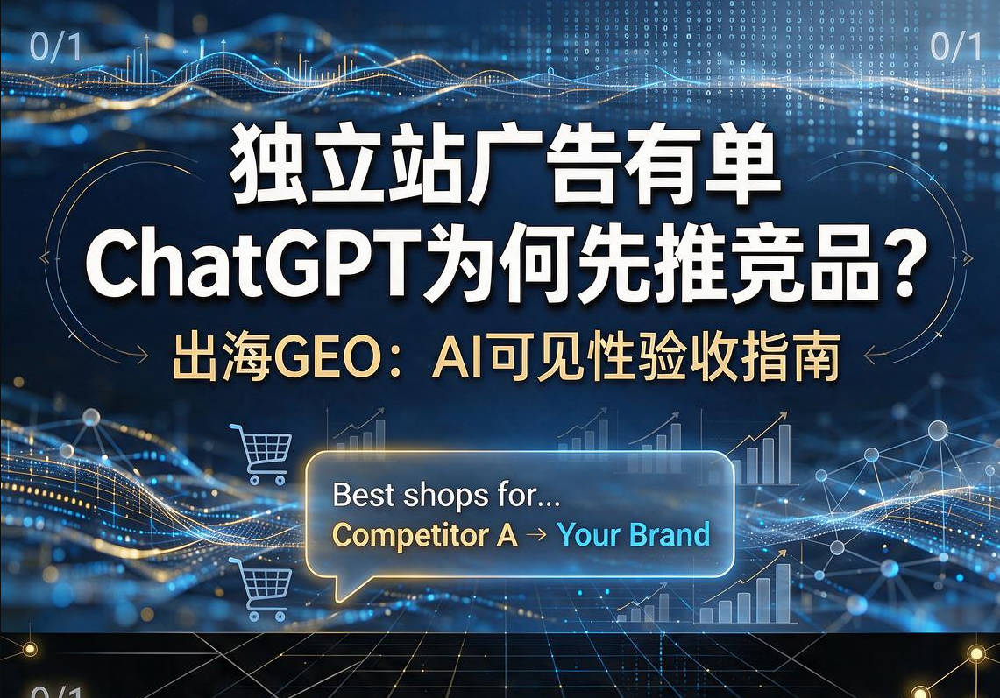
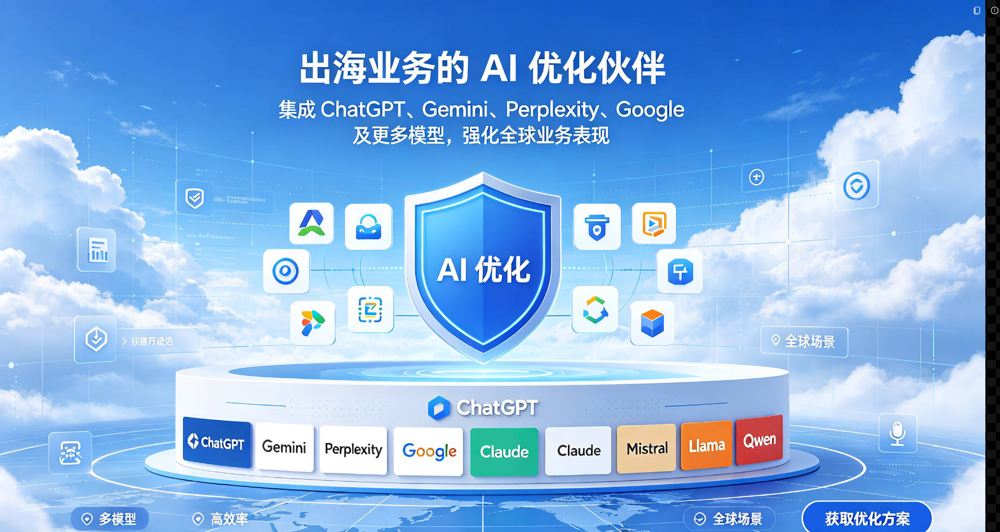

# 收录了为何AI还不提你

很多出海团队会先查：官网有没有被 Google 收录。绿勾一出现，心里就松一半。

可采购侧正在换入口。买家未必先翻结果页，而是直接问 ChatGPT、Gemini 或 Perplexity：这个品类有哪些靠谱供应商，谁更适合欧洲中小客户，某品牌和竞品比该怎么选。

如果答案里没有你，收录再全，也可能错过一轮短名单。收录解决「页面能不能被找到」；AI 答案解决「提问时会不会把你放进回答」。两件事相关，但不是同一张成绩单。

## 一、收录只证明抓得到

收录大致表示：爬虫发现了页面，索引里有记录。它不自动等于：

1. 核心词已经稳定排在前面。
2. AI 会把你的事实写进答案。
3. 买家问品类词时会点名推荐你。

可以把它想成货入了仓。入库只说明货在架子上；顾客进店问店员要推荐清单时，会不会念到你，还取决于货牌清不清、别人有没有更完整说明。

更常见的落差是：独立站技术没大问题，广告也能出询盘，但把销售常听到的英文问题丢进 ChatGPT，品牌几乎不出现，或出现了却把工厂身份、市场、认证说错。

## 二、AI答案看另外三层

第一层：有没有被提到。只用公司名测试不够。要看用品类、场景、区域提问时有没有你。完全缺席、偶尔露脸、多数问题都有，是三种状态。

第二层：说得对不对。AI 综合官网、目录、评测和行业材料。它可能提到你，却把身份、市场、认证写偏。错误提及有时比暂时没出现更伤信任。

第三层：引用和竞品。看答案主要引用谁，再固定三到五个竞品，用同一批问题并排看。Google 排得前，最多说明「搜得到你」还通着，不直接等于「问 AI 时会选你」。

## 三、先查四类常见缺口

第一，事实是不是散。能力、市场、认证、交付边界如果只活在 PDF 和口头介绍里，页面又含糊，模型很难稳定复述。

第二，页面是不是只有口号。全是「全球领先」，缺少可核对的产品边界和场景要点，AI 更难把你写进比较句。

第三，外部声音是不是空白。模型常交叉验证。行业里几乎没有与你相关的第三方描述，只靠自家站，进入推荐会更慢。

第四，问题词是不是对不上。你优化品牌词，买家问的是品类加区域加交付。词表不一致，就会「搜品牌能找到，问场景找不到」。

多数团队最先卡住第一和第四：以为讲清了，但页面缺少可抽取短句；销售问题也没沉淀成可复测的英文问法。

## 四、两周可做的自测

第一周：从询盘和销售记录抽出 20 到 30 条真实英文问法，覆盖推荐、对比、替代、区域、信任、交付。在 ChatGPT、Gemini、Perplexity 各跑一遍，记录有没有你、说法对不对、引用了谁。

第二周：挑最常答错或最常缺席的五到八个问题，回看官网对应段落，把身份、范围、市场、认证、交期与定制边界写成短句。改完用同一批问题再测。

记住三件事：固定引擎和问题；同时看竞品；把「说错」单独记账，优先修错误再追曝光。

## 五、收录和GEO怎么一起抓

SEO 管可抓取、结构、核心词与页面可发现性。GEO 管固定买家问题下的提及、表述、引用和竞品差距。改内容后用同一批问题复测，不要改完就结束。

向管理层汇报时拆开讲：收录与排名是一层；AI 答案里有没有你、说得准不准、相对竞品怎样，是另一层。混成一句「SEO 已经做好了」，后面排期会对不上。

## 六、什么时候该上监测

手工两周测一轮适合起步。问题一多，还要覆盖多引擎、多市场、多竞品，表格会失控：谁测的、哪天测的、改版后有没有回退，都说不清。

这时要把提示词、引擎、竞品和结果沉淀成可重复查看的记录。可见 GEO 做的就是这件事：盯住海外 AI 答案里的品牌可见性，看有没有被提到、说法偏了没有、引用落在哪里，并和竞品放在同一视野比较。

不必追求「所有答案都推荐我」。更务实的是：该出现时别长期缺席，出现了别被说错，和主要竞品的差距能周周看见。

## 七、先记住这句

Google 收录是起点，不是终点。买家已经会先问 AI。你要同时看两张表：搜索能不能找到你；提问时会不会提到你、说得对不对。先用真实问题做两周复测，再决定要不要上持续监测。

若你正在补海外 AI 可见性这一环，可以用可见 GEO 把提示词、引擎和竞品放到同一套结果里看，少靠感觉，多靠可复查的记录。
